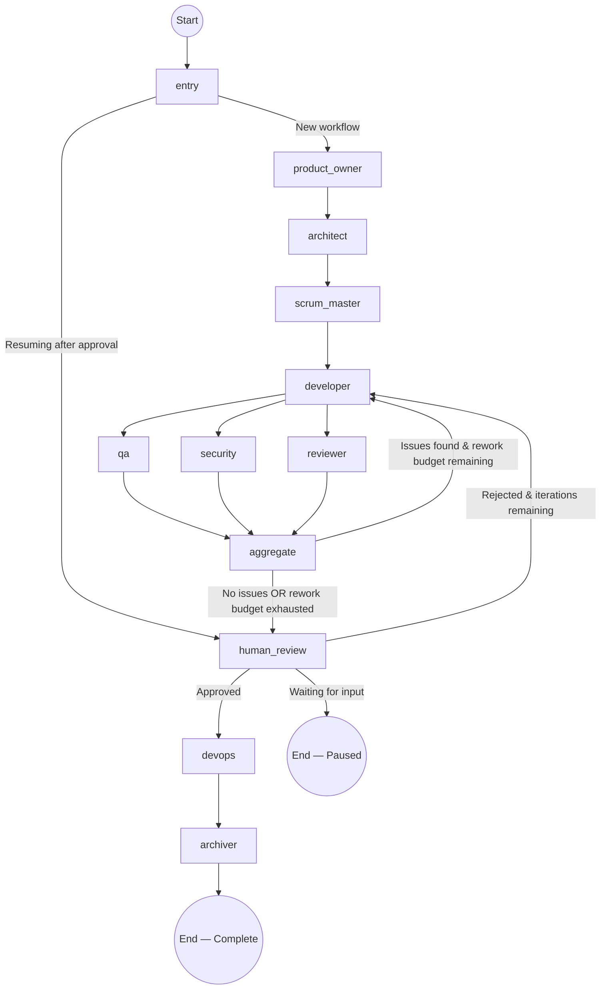

# AI Software Delivery Team — Use Case, Functionality & Architecture

## 1. Problem Statement

Modern software development involves a repeatable, well-known pipeline: **gather requirements → design architecture → plan tasks → write code → test → review → scan for vulnerabilities → deploy**. Every step is done by a different human role (product owner, architect, developer, QA, security engineer, DevOps).

This pipeline is:
- **Slow** — a simple feature can take days to move through all roles.
- **Expensive** — each role is a salaried professional.
- **Error-prone** — handoff between humans introduces miscommunication.

### What This Platform Solves

The **AI Software Delivery Team** replaces each human role with a specialised AI agent, orchestrated by a state machine (LangGraph). A single natural-language prompt from the user (e.g. *"Build a palindrome checker in Python"*) triggers an **end-to-end automated pipeline** that:

1. Breaks the request into structured requirements.
2. Designs a software architecture.
3. Plans implementation tasks with dependencies.
4. Writes real, executable Python code into a sandboxed workspace.
5. Writes and runs `pytest` tests against that code.
6. Scans the code with `bandit` (SAST) and `pip-audit` (SCA).
7. Performs a code review for maintainability and correctness.
8. Auto-reworks the code if quality agents find issues.
9. **Pauses** for a human to approve or reject with feedback.
10. Generates a GCP deployment plan.
11. Zips the workspace into a downloadable archive.

The only human intervention required is the **approval gate** — everything else is fully autonomous.

---

## 2. Multi-Agent Architecture

The platform implements **10 specialised agents** plus 2 infrastructure nodes, organised into a directed acyclic graph (DAG) with feedback loops:

### Agent Roster

| Agent | Role | Implementation Style | Key File |
|-------|------|---------------------|----------|
| **Product Owner** | Analyses user request → structured requirements (JSON) | `invoke_json_model` — single LLM call with Pydantic schema validation | [agents.py:L45-79](file:///c:/MachineLearning/AI%20Software%20Delivery%20Team/backend/src/ai_sdlc/agents.py#L45-L79) |
| **Architect** | Designs API surface, service boundaries, data layer, security controls | `invoke_json_model` | [agents.py:L82-124](file:///c:/MachineLearning/AI%20Software%20Delivery%20Team/backend/src/ai_sdlc/agents.py#L82-L124) |
| **Scrum Master** | Breaks the plan into prioritised tasks with dependency ordering | `invoke_json_model` | [agents.py:L127-158](file:///c:/MachineLearning/AI%20Software%20Delivery%20Team/backend/src/ai_sdlc/agents.py#L127-L158) |
| **Developer** | Writes actual Python files into a sandboxed temp directory | `invoke_agent_with_tools` — ReAct loop with `write_file`, `read_file`, `run_command` | [agents.py:L161-214](file:///c:/MachineLearning/AI%20Software%20Delivery%20Team/backend/src/ai_sdlc/agents.py#L161-L214) |
| **QA Engineer** | Writes pytest tests, runs them, iterates on failures | `invoke_agent_with_tools` — ReAct loop | [agents.py:L217-246](file:///c:/MachineLearning/AI%20Software%20Delivery%20Team/backend/src/ai_sdlc/agents.py#L217-L246) |
| **Security Agent** | Runs `bandit` SAST + `pip-audit` SCA scans via tool use | `invoke_agent_with_tools` — ReAct loop | [agents.py:L249-277](file:///c:/MachineLearning/AI%20Software%20Delivery%20Team/backend/src/ai_sdlc/agents.py#L249-L277) |
| **Reviewer** | Reads workspace files, evaluates maintainability/correctness | `invoke_agent_with_tools` — ReAct loop | [agents.py:L280-309](file:///c:/MachineLearning/AI%20Software%20Delivery%20Team/backend/src/ai_sdlc/agents.py#L280-L309) |
| **Aggregate** | Decision node: auto-rework or forward to human | Deterministic logic (no LLM) | [agents.py:L335-360](file:///c:/MachineLearning/AI%20Software%20Delivery%20Team/backend/src/ai_sdlc/agents.py#L335-L360) |
| **Human Review** | Pauses the graph for manual approve/reject | Deterministic gate (no LLM) | [agents.py:L363-374](file:///c:/MachineLearning/AI%20Software%20Delivery%20Team/backend/src/ai_sdlc/agents.py#L363-L374) |
| **DevOps** | Generates a GCP Cloud Run deployment plan | `invoke_json_model` | [agents.py:L377-404](file:///c:/MachineLearning/AI%20Software%20Delivery%20Team/backend/src/ai_sdlc/agents.py#L377-L404) |
| **Archiver** | Zips workspace → base64 for download | Deterministic (no LLM) | [agents.py:L407-431](file:///c:/MachineLearning/AI%20Software%20Delivery%20Team/backend/src/ai_sdlc/agents.py#L407-L431) |

### Two Types of Agent Execution

1. **`invoke_json_model`** — Single-shot structured output. The LLM is called once, its response is parsed as JSON, and validated against a Pydantic schema ([schemas.py](file:///c:/MachineLearning/AI%20Software%20Delivery%20Team/backend/src/ai_sdlc/schemas.py)). Used by: Product Owner, Architect, Scrum Master, DevOps.

2. **`invoke_agent_with_tools`** — Multi-step ReAct (Reason + Act) loop. The LLM autonomously calls tools (`write_file`, `read_file`, `list_directory`, `run_command`) in a loop until it decides it has completed its task. Used by: Developer, QA, Security, Reviewer.

---

## 3. Workflow Routing (LangGraph State Machine)

The entire workflow is defined as a **LangGraph `StateGraph`** in [graph.py](file:///c:/MachineLearning/AI%20Software%20Delivery%20Team/backend/src/ai_sdlc/graph.py).

### Visual Flow



### Key Routing Functions

| Function | Location | Logic |
|----------|----------|-------|
| `route_from_entry` | [graph.py:L34-37](file:///c:/MachineLearning/AI%20Software%20Delivery%20Team/backend/src/ai_sdlc/graph.py#L34-L37) | If status is `awaiting_approval`, skip straight to `human_review` (resume path). Otherwise start fresh from `product_owner`. |
| `route_after_aggregate` | [graph.py:L74-78](file:///c:/MachineLearning/AI%20Software%20Delivery%20Team/backend/src/ai_sdlc/graph.py#L74-L78) | If status is `auto_rework`, loop back to `developer`. Otherwise proceed to `human_review`. |
| `route_after_human_review` | [graph.py:L40-45](file:///c:/MachineLearning/AI%20Software%20Delivery%20Team/backend/src/ai_sdlc/graph.py#L40-L45) | `approved=True` → `devops`. `approved=False` (and iterations left) → `developer`. `approved=None` → `END` (graph pauses, waits for user). |

### Parallel Execution

After the Developer finishes, **QA, Security, and Reviewer run in parallel** (lines 110-112 of graph.py create fan-out edges). All three converge at `aggregate` (lines 114-116 create fan-in edges).

### Auto-Rework Loop

The `_has_actionable_findings()` function ([agents.py:L312-332](file:///c:/MachineLearning/AI%20Software%20Delivery%20Team/backend/src/ai_sdlc/agents.py#L312-L332)) checks if QA/Security/Reviewer found real issues (filtering out LLM fallback messages and "no issues found" responses). If issues exist and `auto_rework_count < max_auto_reworks` (default 1), the workflow loops back to the Developer with the feedback injected via `agent_feedback_context()`.

---

## 4. Workflow State

All agent outputs flow through a single shared `WorkflowState` TypedDict ([state.py](file:///c:/MachineLearning/AI%20Software%20Delivery%20Team/backend/src/ai_sdlc/state.py)):

| Field | Type | Purpose |
|-------|------|---------|
| `workflow_id` | `str` | Unique UUID per workflow |
| `user_request` | `str` | Original natural-language prompt |
| `requirements` | `Dict` | Product Owner output |
| `architecture` | `Dict` | Architect output |
| `tasks` | `List[Dict]` | Scrum Master output |
| `generated_code` | `str` | Developer summary |
| `test_cases` | `str` | QA summary |
| `security_findings` | `List[str]` | Security agent output |
| `review_comments` | `List[str]` | Reviewer output |
| `deployment_plan` | `Dict` | DevOps output |
| `approved` | `Optional[bool]` | `None`=waiting, `True`=approved, `False`=rejected |
| `human_feedback` | `str` | Rejection feedback text |
| `iteration_count` | `int` | Current dev iteration (increments on each rework) |
| `max_iterations` | `int` | Max allowed iterations (default 3) |
| `auto_rework_count` | `int` | Auto-rework rounds used |
| `max_auto_reworks` | `int` | Max auto-rework rounds (default 1) |
| `status` | `str` | Current workflow phase |
| `workspace_dir` | `str` | Temp directory path for sandboxed file I/O |
| `project_archive_base64` | `Optional[str]` | Base64-encoded zip of final codebase |
| `execution_log` | `Annotated[List[str], add]` | Append-only log of agent completions |

> [!NOTE]
> The `execution_log` uses LangGraph's `Annotated[List[str], add]` reducer, meaning each agent's log entries are **appended** rather than overwritten.

---

## 5. Context Window Management

Each agent only receives the state fields it actually needs, truncated to safe token limits. This is handled by [context.py](file:///c:/MachineLearning/AI%20Software%20Delivery%20Team/backend/src/ai_sdlc/context.py):

| Agent | Fields Received | Char Limits |
|-------|----------------|-------------|
| Product Owner | `user_request` | 2,000 |
| Architect | `user_request`, `requirements` | 2,000 + 4,000 |
| Scrum Master | `user_request`, `requirements`, `architecture` | 2,000 + 4,000 + 4,000 |
| Developer | `user_request`, `requirements`, `architecture`, `tasks`, `human_feedback` + agent feedback | 2,000 + 4,000 + 4,000 + 4,000 + 2,000 + 6,000 |
| QA | `user_request`, workspace files | 2,000 + 12,000 |
| Security | `user_request`, `architecture`, workspace files | 2,000 + 4,000 + 12,000 |
| Reviewer | `user_request`, `requirements`, workspace files | 2,000 + 4,000 + 12,000 |

---

## 6. API Endpoints

The backend exposes 7 REST endpoints via FastAPI ([api.py](file:///c:/MachineLearning/AI%20Software%20Delivery%20Team/backend/src/ai_sdlc/api.py)):

| Method | Path | Purpose |
|--------|------|---------|
| `GET` | `/health` | Health check |
| `POST` | `/workflows` | Create workflow (synchronous, blocks until completion) |
| `POST` | `/workflows/stream` | Create workflow with SSE streaming |
| `GET` | `/workflows` | List all workflows |
| `GET` | `/workflows/{id}` | Get specific workflow state |
| `GET` | `/workflows/{id}/download` | Download zipped codebase |
| `POST` | `/workflows/{id}/approval` | Submit approval (synchronous) |
| `POST` | `/workflows/{id}/approval/stream` | Submit approval with SSE streaming |

### SSE Streaming Protocol

The streaming endpoints emit Server-Sent Events with these event types:

| Event | Payload | When |
|-------|---------|------|
| `workflow_started` | `{workflow_id, status}` | Stream begins |
| `agent_update` | `{workflow_id, node, status, delta}` | An agent node completes |
| `ping` | `{message: "Agent is thinking..."}` | Every 15s keep-alive |
| `workflow_completed` | `{workflow_id, status, state}` | All nodes finished |
| `workflow_error` | `{workflow_id, error}` | Unrecoverable error |

---

## 7. Frontend Interaction Model

The frontend is a single-page vanilla JS application ([index.html](file:///c:/MachineLearning/AI%20Software%20Delivery%20Team/backend/frontend/index.html), [app.js](file:///c:/MachineLearning/AI%20Software%20Delivery%20Team/backend/frontend/app.js), [style.css](file:///c:/MachineLearning/AI%20Software%20Delivery%20Team/backend/frontend/style.css)) served directly by FastAPI as static files.

### User Flow

1. User types a feature description in the sidebar textarea.
2. Clicks **"Start Orchestration"** → `POST /workflows/stream`.
3. The terminal panel shows real-time agent completion logs streamed via SSE.
4. When `status === "awaiting_approval"`, an **approval modal** appears with `generated_code` and `test_cases` summaries.
5. User clicks **Approve** or **Reject** → `POST /workflows/{id}/approval/stream`.
6. On approval, remaining agents (DevOps + Archiver) run, then a **"Download Codebase"** button appears.

---

## 8. Sandbox & Tool System

The Developer, QA, Security, and Reviewer agents operate inside a **sandboxed temporary directory** unique to each workflow:

```
%TEMP%/ai_sdlc/<workflow_id>/
├── main.py           (written by Developer)
├── test_main.py      (written by QA)
├── requirements.txt  (written by Developer)
└── .venv/            (auto-created by run_command tool)
```

The 4 available tools are defined in [tools.py](file:///c:/MachineLearning/AI%20Software%20Delivery%20Team/backend/src/ai_sdlc/tools.py):

| Tool | Purpose | Security |
|------|---------|----------|
| `write_file` | Write content to a file | Path traversal protection via `_enforce_workspace()` |
| `read_file` | Read a file's content | Same path enforcement |
| `list_directory` | List directory contents | Same path enforcement |
| `run_command` | Execute shell commands | Runs inside a virtual environment with 30s timeout |

> [!IMPORTANT]
> The `_enforce_workspace()` function ([tools.py:L11-20](file:///c:/MachineLearning/AI%20Software%20Delivery%20Team/backend/src/ai_sdlc/tools.py#L11-L20)) resolves all paths and verifies they don't escape the workspace directory, preventing path traversal attacks like `../../etc/passwd`.
