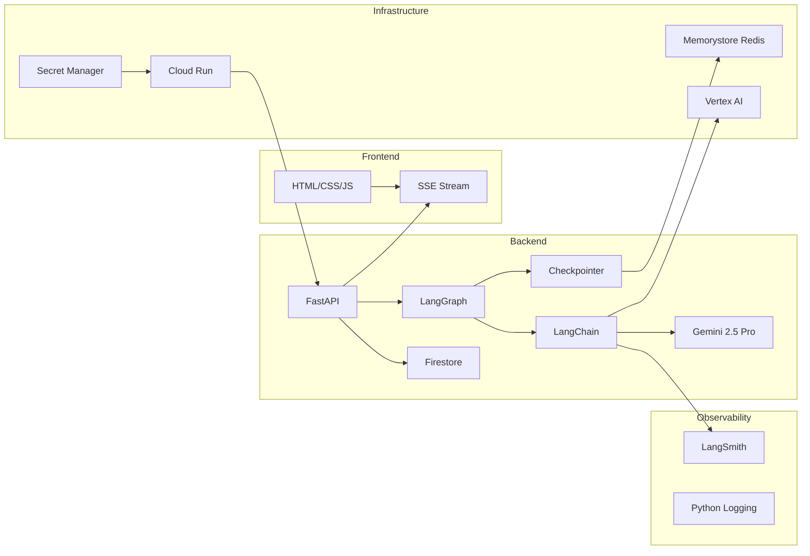

# AI Software Delivery Team — Technology Stack Deep-Dive

This document explains **every technology** used in the platform, **why** it was chosen over alternatives, **where** it appears in the codebase, and **how** the pieces fit together.

---

## 1. Core Framework Layer

### Python 3.10+
- **What**: The primary programming language for the entire backend.
- **Why**: Python is the de facto standard for AI/ML applications. LangChain, LangGraph, and all Google AI SDKs are Python-first.
- **Where**: All backend code under [backend/src/ai_sdlc/](file:///c:/MachineLearning/AI%20Software%20Delivery%20Team/backend/src/ai_sdlc).

### FastAPI
- **What**: A modern, high-performance async Python web framework.
- **Why chosen over Flask/Django**:
  - Native async/await support (critical for SSE streaming).
  - Automatic OpenAPI documentation.
  - Built-in Pydantic model validation for request/response schemas.
  - First-class `StreamingResponse` support for Server-Sent Events.
- **Where**: [api.py](file:///c:/MachineLearning/AI%20Software%20Delivery%20Team/backend/src/ai_sdlc/api.py) — all 8 REST endpoints and the SSE streaming logic.
- **Key usage**: `StreamingResponse` wraps the `_stream_workflow()` generator to push real-time agent updates to the browser.

### Uvicorn
- **What**: An ASGI server that runs the FastAPI application.
- **Why**: The recommended production server for FastAPI. Supports HTTP/1.1 keep-alive (required for SSE) and is lightweight enough for containerised deployment.
- **Where**: [Dockerfile:L27](file:///c:/MachineLearning/AI%20Software%20Delivery%20Team/backend/Dockerfile#L27) — `CMD ["uvicorn", "ai_sdlc.api:app", "--host", "0.0.0.0", "--port", "8080"]`

---

## 2. AI Orchestration Layer

### LangGraph
- **What**: A graph-based orchestration framework from LangChain for building stateful, multi-agent workflows.
- **Why chosen over raw LangChain chains**:
  - **State machine semantics**: Nodes, edges, and conditional routing map perfectly to SDLC phases.
  - **Built-in checkpointing**: The graph can pause at the `human_review` node and resume later without losing state.
  - **Parallel fan-out**: QA, Security, and Reviewer run concurrently after Developer.
  - **Conditional edges**: Auto-rework loops and approval routing are first-class features.
- **Where**: [graph.py](file:///c:/MachineLearning/AI%20Software%20Delivery%20Team/backend/src/ai_sdlc/graph.py) — `StateGraph`, `add_node`, `add_edge`, `add_conditional_edges`, `compile`.
- **Key concept**: The compiled graph is invoked with `.stream()` to yield chunks (one per node completion), enabling real-time SSE updates.

### LangGraph Checkpointer (MemorySaver / RedisSaver)
- **What**: A persistence layer that snapshots the graph state after each node.
- **Why**: Required for the **human-in-the-loop** pattern. When the graph pauses at `human_review`, the full state must be persisted so it can be resumed hours later when the user clicks Approve.
- **Where**: [graph.py:L48-71](file:///c:/MachineLearning/AI%20Software%20Delivery%20Team/backend/src/ai_sdlc/graph.py#L48-L71) — `_create_checkpointer()` tries Redis first, falls back to in-memory.
- **Trade-off**: `MemorySaver` works for development but loses state on container restart. `RedisSaver` requires Redis Stack with RedisJSON module.

### LangChain
- **What**: The foundational AI application framework. Provides the `ChatGoogleGenerativeAI` model wrapper, `HumanMessage`/`SystemMessage` types, and the `@tool` decorator.
- **Why**: It standardises the interface between our code and Google's Gemini API. Swapping from Gemini to Claude or GPT would only require changing the model class, not the agent logic.
- **Where**: [llm.py](file:///c:/MachineLearning/AI%20Software%20Delivery%20Team/backend/src/ai_sdlc/llm.py) — `ChatGoogleGenerativeAI`, `create_react_agent`.

### LangChain `create_react_agent`
- **What**: A prebuilt ReAct (Reason + Act) agent that gives an LLM the ability to autonomously call tools in a loop.
- **Why**: The Developer, QA, Security, and Reviewer agents need to iteratively write files, run commands, read outputs, and decide their next action. A simple single-shot LLM call cannot do this.
- **How it works**:
  1. The LLM receives the system prompt and tools.
  2. It generates a "thought" (reasoning), then a tool call.
  3. The tool executes, and the result is appended to the message history.
  4. The LLM sees the result and decides: call another tool, or return a final answer.
  5. Repeat up to `recursion_limit=30`.
- **Where**: [llm.py:L165-197](file:///c:/MachineLearning/AI%20Software%20Delivery%20Team/backend/src/ai_sdlc/llm.py#L165-L197) — `invoke_agent_with_tools()`.

---

## 3. AI Model Layer

### Google Gemini 2.5 Pro (via Vertex AI)
- **What**: Google's most capable large language model, accessed through the Vertex AI managed service.
- **Why Vertex AI over Gemini Developer API**:
  - **No API key required** — authentication is handled by Google Cloud IAM and Application Default Credentials (ADC).
  - **Enterprise SLAs** — guaranteed uptime and throughput.
  - **VPC-native** — traffic stays within Google's network when deployed on Cloud Run.
- **Configuration**: Model name, temperature, and project are set via environment variables.
- **Where**: [llm.py:L74-106](file:///c:/MachineLearning/AI%20Software%20Delivery%20Team/backend/src/ai_sdlc/llm.py#L74-L106) — `get_gemini_model()`.
- **Key setting**: `response_mime_type="application/json"` forces structured JSON output for the `invoke_json_model` agents.

---

## 4. Data Validation Layer

### Pydantic v2
- **What**: Python's most popular data validation library. Enforces strict schemas on both API payloads and LLM outputs.
- **Why**: 
  - **API layer**: FastAPI uses Pydantic models for automatic request validation (`WorkflowCreate`, `ApprovalRequest`) and response serialisation (`WorkflowResponse`).
  - **LLM output layer**: Each `invoke_json_model` call validates the LLM's JSON response against a Pydantic schema (`RequirementsOutput`, `ArchitectureOutput`, etc.). If the LLM returns malformed JSON, Pydantic raises a `ValidationError` and the agent falls back to deterministic output.
- **Where**:
  - API models: [models.py](file:///c:/MachineLearning/AI%20Software%20Delivery%20Team/backend/src/ai_sdlc/models.py)
  - LLM schemas: [schemas.py](file:///c:/MachineLearning/AI%20Software%20Delivery%20Team/backend/src/ai_sdlc/schemas.py)

---

## 5. Persistence Layer

### Google Cloud Firestore
- **What**: A serverless, NoSQL document database.
- **Why chosen over PostgreSQL/MongoDB**:
  - **Zero ops** — no database server to manage, scales automatically.
  - **Native GCP integration** — uses the same IAM credentials as Cloud Run.
  - **Document model** — workflow state is a nested dict, which maps perfectly to Firestore documents.
- **Where**: [store.py](file:///c:/MachineLearning/AI%20Software%20Delivery%20Team/backend/src/ai_sdlc/store.py) — `WorkflowStore` class.
- **Limitation**: 1MB per document. We strip `project_archive_base64` before saving.

### Redis (GCP Memorystore)
- **What**: An in-memory key-value store used for two purposes:
  1. **LLM response caching** — identical prompts return cached results (24h TTL), saving API costs.
  2. **LangGraph checkpointing** (attempted) — persisting graph state for human-in-the-loop.
- **Why Redis over Memcached**: Redis supports complex data types (hashes, sorted sets) and persistence, both required by `langgraph-checkpoint-redis`.
- **Where**:
  - LLM caching: [llm.py:L26-50](file:///c:/MachineLearning/AI%20Software%20Delivery%20Team/backend/src/ai_sdlc/llm.py#L26-L50)
  - Checkpointing: [graph.py:L48-71](file:///c:/MachineLearning/AI%20Software%20Delivery%20Team/backend/src/ai_sdlc/graph.py#L48-L71)

---

## 6. Security Scanning Layer

### Bandit (SAST)
- **What**: A static application security testing tool for Python. Scans source code for common vulnerabilities (hardcoded passwords, SQL injection, insecure `eval()` usage).
- **Why**: It's the industry-standard Python SAST tool, runs completely offline, requires no API keys, and is non-interactive — perfect for automated pipelines.
- **Where**: Installed via [pyproject.toml:L34](file:///c:/MachineLearning/AI%20Software%20Delivery%20Team/backend/pyproject.toml#L34) as a dev dependency. Invoked by the Security Agent via `run_command("bandit -r .")`.

### pip-audit (SCA)
- **What**: A software composition analysis tool that checks installed Python packages against the PyPI vulnerability database.
- **Why chosen over `safety`**: `safety` 3.7+ requires interactive authentication, which hangs in headless environments. `pip-audit` is fully non-interactive and maintained by the Python Packaging Authority (PyPA).
- **Where**: Installed via [pyproject.toml:L35](file:///c:/MachineLearning/AI%20Software%20Delivery%20Team/backend/pyproject.toml#L35). Invoked by the Security Agent via `run_command("pip-audit")`.

---

## 7. Observability Layer

### LangSmith
- **What**: LangChain's observability and evaluation platform. Captures full traces of every LLM call, tool invocation, and agent step.
- **Why**: 
  - **Debugging**: You can see the exact prompt sent to Gemini, the raw response, and every tool call in the ReAct loop.
  - **Cost tracking**: Shows token counts and latency per call.
  - **Evaluation**: Supports building datasets and running LLM-as-a-judge evaluators.
- **Configuration**: Set via 4 environment variables (`LANGCHAIN_TRACING_V2`, `LANGCHAIN_API_KEY`, `LANGCHAIN_PROJECT`, `LANGCHAIN_ENDPOINT`).
- **Where**: [logging_config.py](file:///c:/MachineLearning/AI%20Software%20Delivery%20Team/backend/src/ai_sdlc/logging_config.py) — validates tracing config on startup.
- **Security**: The API key is stored in **Google Cloud Secret Manager** and injected into Cloud Run via `--set-secrets`.

### Python `logging` Module
- **What**: Standard library structured logging.
- **Why**: Every agent, API endpoint, and infrastructure function emits structured log lines with `workflow_id`, `agent_name`, and `status` for easy grep/search.
- **Format**: `%(asctime)s | %(levelname)s | %(name)s | %(message)s`
- **Where**: [logging_config.py](file:///c:/MachineLearning/AI%20Software%20Delivery%20Team/backend/src/ai_sdlc/logging_config.py) — configured globally on app startup.

---

## 8. Deployment & Infrastructure Layer

### Google Cloud Run
- **What**: A fully managed serverless container platform.
- **Why chosen over GKE/App Engine**:
  - **Scale to zero** — no cost when idle.
  - **Source deploy** — `gcloud run deploy --source` builds the Docker image in the cloud automatically.
  - **Managed HTTPS** — automatic TLS certificates.
  - **Direct VPC Egress** — can reach internal Redis without a VPC connector.
- **Where**: [deploy-cloud-run.ps1](file:///c:/MachineLearning/AI%20Software%20Delivery%20Team/scripts/deploy-cloud-run.ps1)

### Google Cloud Secret Manager
- **What**: A secure vault for storing API keys and credentials.
- **Why**: Prevents hardcoding secrets in deployment scripts or environment variables visible in the Cloud Console.
- **Where**: [deploy-cloud-run.ps1:L36-40](file:///c:/MachineLearning/AI%20Software%20Delivery%20Team/scripts/deploy-cloud-run.ps1#L36-L40) — grants `secretAccessor` role. [deploy-cloud-run.ps1:L64](file:///c:/MachineLearning/AI%20Software%20Delivery%20Team/scripts/deploy-cloud-run.ps1#L64) — `--set-secrets` flag.

### Docker
- **What**: Container runtime. The backend is packaged as a Docker image.
- **Why**: Ensures identical runtime environments between local development and Cloud Run production.
- **Key decisions in Dockerfile**:
  - Base image: `python:3.10-slim` (minimal footprint).
  - Non-root user (`appuser`) for security.
  - Health check endpoint: `http://localhost:8080/health`.
- **Where**: [Dockerfile](file:///c:/MachineLearning/AI%20Software%20Delivery%20Team/backend/Dockerfile)

---

## 9. Frontend Layer

### Vanilla HTML/CSS/JavaScript
- **What**: A single-page application with no framework dependencies.
- **Why chosen over React/Vue/Next.js**:
  - **Zero build step** — served directly as static files by FastAPI.
  - **Minimal complexity** — the frontend is a terminal-style log viewer with one modal, not a complex SPA.
  - **Instant deployment** — no `npm build`, no webpack, no Node.js dependency.
- **Where**: [backend/frontend/](file:///c:/MachineLearning/AI%20Software%20Delivery%20Team/backend/frontend) — `index.html`, `style.css`, `app.js`.

### Server-Sent Events (SSE)
- **What**: A browser-native protocol for unidirectional real-time streaming from server to client.
- **Why chosen over WebSocket**: SSE is simpler (HTTP-based, auto-reconnect), sufficient for our use case (server pushes agent updates; client only sends approval/rejection via separate POST requests), and natively supported by `fetch()` + `ReadableStream`.
- **Where**: [app.js:L23-88](file:///c:/MachineLearning/AI%20Software%20Delivery%20Team/backend/frontend/app.js#L23-L88) — `streamResponse()` function.

---

## 10. Development & Build Tools

### setuptools + pyproject.toml
- **What**: Python's standard build system configuration.
- **Why**: Modern Python packaging with `[project]` table, `[project.optional-dependencies]` for dev tools, and `[tool.setuptools.packages.find]` for automatic package discovery.
- **Where**: [pyproject.toml](file:///c:/MachineLearning/AI%20Software%20Delivery%20Team/backend/pyproject.toml)

### python-dotenv
- **What**: Loads `.env` files into `os.environ`.
- **Why**: Enables local development with different credentials than production. The `.env` file is gitignored.
- **Where**: [llm.py:L17-18](file:///c:/MachineLearning/AI%20Software%20Delivery%20Team/backend/src/ai_sdlc/llm.py#L17-L18), [graph.py:L24-25](file:///c:/MachineLearning/AI%20Software%20Delivery%20Team/backend/src/ai_sdlc/graph.py#L24-L25)

### pytest
- **What**: Python's most popular testing framework.
- **Why**: Used both by the QA Agent (to test generated code) and by developers (to test the platform itself).
- **Where**: [pyproject.toml:L32](file:///c:/MachineLearning/AI%20Software%20Delivery%20Team/backend/pyproject.toml#L32), [pytest.ini](file:///c:/MachineLearning/AI%20Software%20Delivery%20Team/backend/pytest.ini)

---

## Technology Dependency Map

