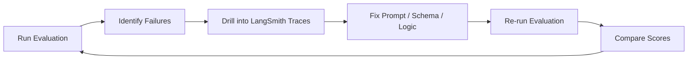
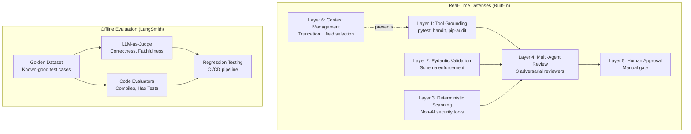

# AI Software Delivery Team — Hallucination Handling & LangSmith Evaluation

## 1. What is Hallucination in This Context?

In the AI SDLC platform, hallucination takes specific, dangerous forms:

| Hallucination Type | Example | Risk |
|-------------------|---------|------|
| **Phantom libraries** | Developer imports `flask-magic-auth` (doesn't exist) | Code crashes on `pip install` |
| **Fabricated APIs** | Architect designs an API endpoint that nobody asked for | Wasted effort, scope creep |
| **False negatives** | Security Agent says "No issues found" when `bandit` flagged 3 vulnerabilities | Vulnerable code gets deployed |
| **Incorrect logic** | Developer writes a palindrome checker that fails on edge cases | Broken functionality |
| **Plausible nonsense** | QA writes tests that always pass regardless of implementation | False confidence |

---

## 2. Built-In Hallucination Defense Layers

Our platform implements **5 layers** of defense against hallucinations, ordered from most to least automated:

### Layer 1: Tool-Grounded Execution (Deterministic Verification)

The most powerful anti-hallucination mechanism. Instead of asking the LLM "what would the test output be?", we **actually execute the code**:

```
Developer writes code → QA writes tests → QA runs `pytest` → real pass/fail result
```

If the Developer hallucinates a library that doesn't exist:
1. QA runs `pytest` via `run_command`.
2. The test crashes with `ModuleNotFoundError`.
3. The error is fed back to the Developer via the auto-rework loop.
4. The Developer rewrites the code with a real library.

**Key file**: [tools.py:L83-135](file:///c:/MachineLearning/AI%20Software%20Delivery%20Team/backend/src/ai_sdlc/tools.py#L83-L135) — the `run_command` tool that grounds agent reasoning in reality.

> [!IMPORTANT]
> This is the single most important anti-hallucination mechanism. An LLM can hallucinate anything in text, but it cannot fake a passing `pytest` run.

---

### Layer 2: Pydantic Schema Validation (Structural Verification)

Every `invoke_json_model` call validates the LLM's output against a strict Pydantic schema:

```python
# If the LLM returns {"priority": "SUPER_URGENT"}, Pydantic rejects it
class RequirementsOutput(BaseModel):
    priority: str = Field(pattern="^(LOW|MEDIUM|HIGH|CRITICAL)$")
```

This catches:
- Missing required fields.
- Wrong data types (string where list expected).
- Invalid enum values.
- Empty lists (via `min_length=1`).

When validation fails, the agent falls back to deterministic output with a clear `llm_fallback_reason` marker.

**Key file**: [schemas.py](file:///c:/MachineLearning/AI%20Software%20Delivery%20Team/backend/src/ai_sdlc/schemas.py) — all 8 Pydantic schemas.

---

### Layer 3: Deterministic Security Scanning (Non-AI Verification)

The Security Agent doesn't rely solely on the LLM's opinion about code safety. It runs real, non-AI security tools:

- **`bandit`** — Static analysis that detects hardcoded passwords, `eval()` usage, SQL injection patterns. These are pattern-matched, not AI-interpreted.
- **`pip-audit`** — Checks installed packages against the CVE database. This is a deterministic database lookup, not an LLM judgment.

Even if the LLM hallucinates "the code is perfectly secure", the `bandit` output will show the real vulnerabilities.

**Key file**: [agents.py:L249-277](file:///c:/MachineLearning/AI%20Software%20Delivery%20Team/backend/src/ai_sdlc/agents.py#L249-L277) — Security Agent prompt instructs use of both tools.

---

### Layer 4: Multi-Agent Adversarial Cross-Checking

Three independent agents (QA, Security, Reviewer) evaluate the Developer's work in parallel. They each use separate LLM invocations with different system prompts, creating an adversarial dynamic:

- **QA** focuses on: Does the code actually work? Do edge cases pass?
- **Security** focuses on: Are there vulnerabilities? Are dependencies safe?
- **Reviewer** focuses on: Is the code maintainable? Are there missing tests?

If **any** agent finds issues, the `aggregate_agent` routes back for auto-rework. This means the Developer's hallucinations must survive scrutiny from 3 independent AI reviewers.

**Key file**: [agents.py:L312-332](file:///c:/MachineLearning/AI%20Software%20Delivery%20Team/backend/src/ai_sdlc/agents.py#L312-L332) — `_has_actionable_findings()`.

---

### Layer 5: Human-in-the-Loop Approval Gate

The final defense is a human reviewer. The LangGraph workflow **physically pauses** at the `human_review` node and cannot proceed until a human clicks Approve or Reject:

- The approval modal displays `generated_code` and `test_cases` summaries.
- The human can read the summary, reject with feedback, and the Developer will iterate.
- Maximum iterations are capped at `max_iterations=3` to prevent infinite loops.

**Key file**: [agents.py:L363-374](file:///c:/MachineLearning/AI%20Software%20Delivery%20Team/backend/src/ai_sdlc/agents.py#L363-L374) — `human_review_node`.

---

### Layer 6: Context Window Management (Prevention)

Hallucinations increase when the LLM receives too much irrelevant context. Our `context.py` module prevents this by:

- Giving each agent **only the fields it needs** (e.g., QA doesn't see the architecture).
- **Truncating** large fields with a clear `[TRUNCATED]` marker.
- Using **compact JSON** serialisation to minimise token usage.

**Key file**: [context.py](file:///c:/MachineLearning/AI%20Software%20Delivery%20Team/backend/src/ai_sdlc/context.py) — per-agent context builders with character limits.

---

## 3. LangSmith Evaluation — Measuring Hallucination at Scale

While the built-in layers prevent hallucinations in real-time, **LangSmith evaluation** lets you systematically measure and improve agent quality over time.

### 3.1 What is LangSmith Evaluation?

LangSmith provides an evaluation framework where you:
1. Create a **Dataset** of test cases (input prompts + expected outputs).
2. Define **Evaluators** (scoring functions that grade agent outputs).
3. Run **Experiments** that execute your agents against the dataset and collect scores.
4. Compare experiments over time to detect regression.

### 3.2 Step-by-Step: Setting Up Evaluation

#### Step 1: Create a Golden Dataset

In the LangSmith web UI:
1. Go to **Datasets & Testing** → **+ New Dataset**.
2. Name it `ai-sdlc-golden-tests`.
3. Add test examples. Each example has:
   - **Input**: The user request (e.g., `"Build a palindrome checker in Python"`)
   - **Expected Output**: What you consider a correct result (e.g., `"The code must include a function named is_palindrome that handles edge cases"`)

Example dataset entries:

| Input | Expected Output |
|-------|----------------|
| "Build a palindrome checker in Python" | "Must include `is_palindrome()` function. Must handle empty strings. Must handle mixed case." |
| "Create a REST API for a todo list" | "Must use FastAPI. Must have GET/POST/DELETE endpoints. Must include Pydantic models." |
| "Write a binary search implementation" | "Must return -1 for not found. Must handle empty arrays. O(log n) complexity." |

#### Step 2: Create Custom Evaluators

LangSmith supports two types of evaluators:

**A. LLM-as-a-Judge Evaluator**

This uses a separate LLM call to grade the agent's output against the expected output:

```python
from langsmith.evaluation import evaluate, LangChainStringEvaluator

# Built-in evaluator: checks if the output matches the expected answer
correctness_evaluator = LangChainStringEvaluator(
    "labeled_criteria",
    config={
        "criteria": {
            "correctness": (
                "Does the generated code correctly implement all the requirements "
                "specified in the expected output? Score 1 if yes, 0 if no."
            )
        }
    }
)

# Built-in evaluator: checks for hallucinated content
hallucination_evaluator = LangChainStringEvaluator(
    "labeled_criteria",
    config={
        "criteria": {
            "hallucination": (
                "Does the generated code import any libraries that don't exist, "
                "reference any APIs that weren't requested, or make any factual claims "
                "that are incorrect? Score 1 if NO hallucinations, 0 if hallucinations exist."
            )
        }
    }
)
```

**B. Code-Based Evaluator (Deterministic)**

This uses Python code to check specific properties:

```python
from langsmith.evaluation import EvaluationResult

def has_test_cases(run, example) -> EvaluationResult:
    """Check if the QA agent actually generated test files."""
    output = run.outputs.get("test_cases", "")
    has_tests = "def test_" in output or "class Test" in output
    return EvaluationResult(
        key="has_test_cases",
        score=1.0 if has_tests else 0.0,
        comment="Test cases found" if has_tests else "No test cases generated"
    )

def code_executes(run, example) -> EvaluationResult:
    """Check if the generated code actually runs without errors."""
    code = run.outputs.get("generated_code", "")
    try:
        compile(code, "<string>", "exec")
        return EvaluationResult(key="compiles", score=1.0)
    except SyntaxError as e:
        return EvaluationResult(key="compiles", score=0.0, comment=str(e))
```

#### Step 3: Run an Evaluation Experiment

```python
from langsmith import Client
from langsmith.evaluation import evaluate

client = Client()

def run_ai_sdlc_agent(inputs: dict) -> dict:
    """Run the full workflow and return outputs."""
    import requests
    response = requests.post(
        "https://ai-sdlc-backend-YOUR_HASH.run.app/workflows",
        json={"user_request": inputs["input"], "max_iterations": 3}
    )
    state = response.json()["state"]
    return {
        "generated_code": state.get("generated_code", ""),
        "test_cases": state.get("test_cases", ""),
        "security_findings": state.get("security_findings", []),
    }

# Run evaluation
results = evaluate(
    run_ai_sdlc_agent,
    data="ai-sdlc-golden-tests",
    evaluators=[
        correctness_evaluator,
        hallucination_evaluator,
        has_test_cases,
        code_executes,
    ],
    experiment_prefix="v1.0-gemini-2.5-pro",
)
```

#### Step 4: Analyse Results in the LangSmith Dashboard

After running the evaluation:
1. Go to **Datasets & Testing** → `ai-sdlc-golden-tests` → **Experiments**.
2. You'll see a table with scores for each evaluator per test case.
3. Click on any row to see the full trace, including the exact prompts and responses.
4. Compare multiple experiment runs side-by-side to detect regression.

---

### 3.3 Recommended Evaluator Suite

| Evaluator | Type | What It Measures |
|-----------|------|-----------------|
| **Correctness** | LLM-as-Judge | Does the code implement all specified requirements? |
| **Hallucination** | LLM-as-Judge | Does the code reference non-existent libraries or APIs? |
| **Faithfulness** | LLM-as-Judge | Does the output stay faithful to the user's original request? |
| **has_test_cases** | Code-based | Did the QA agent actually generate pytest tests? |
| **code_compiles** | Code-based | Does the generated code compile without syntax errors? |
| **no_security_issues** | Code-based | Did `bandit` report zero findings? |
| **requirements_complete** | LLM-as-Judge | Are all acceptance criteria from the Product Owner satisfied? |

---

### 3.4 Automated Regression Testing

You can set up a **CI/CD pipeline** that runs evaluations on every code change:

```yaml
# .github/workflows/eval.yml
name: LangSmith Evaluation
on:
  push:
    branches: [main]

jobs:
  evaluate:
    runs-on: ubuntu-latest
    steps:
      - uses: actions/checkout@v4
      - uses: actions/setup-python@v5
        with:
          python-version: "3.10"
      - run: pip install langsmith langchain
      - run: python scripts/run_evaluation.py
        env:
          LANGCHAIN_API_KEY: ${{ secrets.LANGCHAIN_API_KEY }}
          LANGCHAIN_PROJECT: ai-sdlc
```

This will:
1. Run all test cases against your deployed backend.
2. Score each output with your evaluators.
3. Upload results to LangSmith for visual comparison.
4. Fail the pipeline if any evaluator drops below a threshold.

---

### 3.5 Using Traces for Root Cause Analysis

When an evaluator flags a hallucination, you can drill into the exact cause:

1. **Open the failing trace** in LangSmith.
2. **Find the agent node** that produced the bad output (e.g., Developer).
3. **Read the full prompt** — was the context window missing critical information?
4. **Check tool calls** — did the agent skip running tests? Did it ignore `bandit` output?
5. **Compare with passing traces** — what was different about the successful runs?

This creates a feedback loop:



---

### 3.6 Offline Evaluation Implementation (`run_evaluation.py`)

We implemented a dedicated offline evaluation pipeline in `backend/scripts/run_evaluation.py` to track regression over time.

**The Golden Dataset (8 Prompts):**
To properly stress-test the multi-agent orchestration, we bypass trivial tasks (like palindromes) and evaluate against 8 rigorous software engineering scenarios:
1. **JWT Auth API** (Tests security, bcrypt, token expiry)
2. **Sliding Window Rate Limiter** (Tests algorithmic complexity and concurrency)
3. **CSV Upload Validator** (Tests file I/O, validation, and error formatting)
4. **Webhook Retry System** (Tests exponential backoff and network handling)
5. **Multi-tenant RBAC API** (Tests architectural isolation and permissions)
6. **Blog API with SQLite** (Tests ORM, relational data, and pagination)
7. **JSON File Watcher CLI** (Tests non-API tool generation)
8. **Async Job Queue** (Tests background workers and state management)

**Deterministic Evaluators (Zero LLM-Judge):**
Instead of using another LLM to judge the output (which risks evaluator hallucination), we score runs based on hard, deterministic facts pulled from the agent sandbox:
- `workflow_completed`: Did it reach the approval gate without crashing?
- `code_generated`: Did the developer produce actual files (not a fallback string)?
- `tests_generated`: Did the QA agent write `def test_` functions?
- `security_clean`: Did `bandit` + `pip-audit` report 0 actionable findings?
- `no_llm_fallback`: Did all agents successfully use the Vertex AI API?

**Execution:**
```powershell
venv\Scripts\python.exe backend\scripts\run_evaluation.py --experiment "v2.0-flash-lite"
```
This takes ~30 minutes to run all 8 workflows and uploads the binary (1.0 or 0.0) scores directly to the LangSmith dashboard for visual comparison across runs.

---

## 4. Summary: Defense-in-Depth Against Hallucination



> [!TIP]
> The real-time defenses catch hallucinations **before they reach the user**. The LangSmith evaluations measure how often hallucinations occur **over time**, enabling you to tune prompts and improve agent quality systematically.
